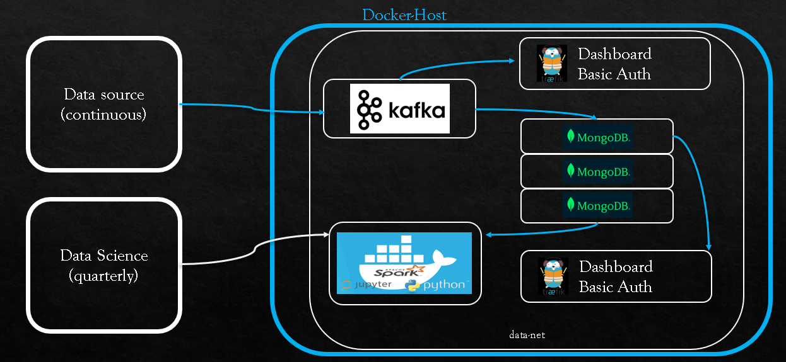
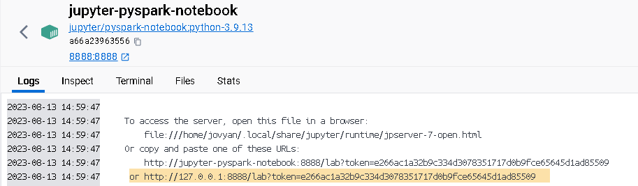

# IU_DataEngineering_IaC_MF
IaC mit Docker Compose

    GitHub: https://github.com/Pandassir/DataEngineering_IU_MF.git

1) Use Case:
    Supermarktdaten --> Pipeline --> ML

    

2) Anweisung:
    Zuerst müssen alle Dateien von GitHub heruntergeladen werden. Desweiteren muss Docker Desktop auf dem PC installiert werden.
    Über folgenden Befehl müssen die Container gestartet werden:

        docker-compose up -d
    
    Es ist zudem zu beachten, dass der Verzeichnispfad, indem die Dateien liegen, im Terminal angegeben ist.

3) Nachdem die Container laufen, müssen die Konfigurationsdateien für die Registrierung der Mongo Replika Instanzen ausgeführt werden.
    Zudem muss der MongoDB-Kafka Konnektor initialisiert werden. Für beide Aktionen sind vorgefertigte Dateien vorhanden. 
    Lesen Sie zur Durchführung der oben genannten Aktionen folgende Text-Datei im Ordner "scripts":

        READ_run-registry

    Sollte die Registrierung oder Initialisierung stoppen, dann können die Befehle nochmal gestartet werden.

4) Die Verkaufsdaten können entweder extern mit Python (sales-source-out.py) oder intern mit dem Jupyter/Pyspark-Notebook (sales-source-in.py)
    gesendt werden. Das kann einige Zeit dauern. Der Status sollte im Python Terminal angezeigt werden.
    Beachte!: Um das Jupyter/Pyspark-Notebook zu öffnen, gehe auf den Container und suche das Link:

     (Example!)

5) Nachdem die Daten von Python zu Kafka und von Kafka in die MongoDB-Datenbanken gealden wurden, können diese mit Pyspark im Jupyter/Pyspark-Notebook bearbeitet werden.
    Dafür kann die "sales-spark-session.py" - Datei verwendet werden. Bitte  zuerst den Code von '''Initializing the Spark-Mongo Connector''' ausführen und anschließend kann der 
    Code von '''Loading data as DataFrame using Spark'''  ausgeführt werden.

6) Dashboards:
    - Mongo-Express:                mongo-express.localhost     (Copy-Paste in den Webbrowser)
    - Kafka-Kontrollcenter:         control-center.localhost    (Copy-Paste in den Webbrowser)
    - Topic-UI:                     kafka-topics-ui.localhost   (Copy-Paste in den Webbrowser)

    Für alle 3 Dashboards wurde folgenden Basic Auth Anmeldedaten eingerichtet:

        user: test         passwort: password

7) Im Rahmen dieses Projekt wurde für Testzwecke lediglich Basic Auth gewählt. Es können jedoch über Treafik weitere Sicherheitseinstellungen vorgenommen werden. 

